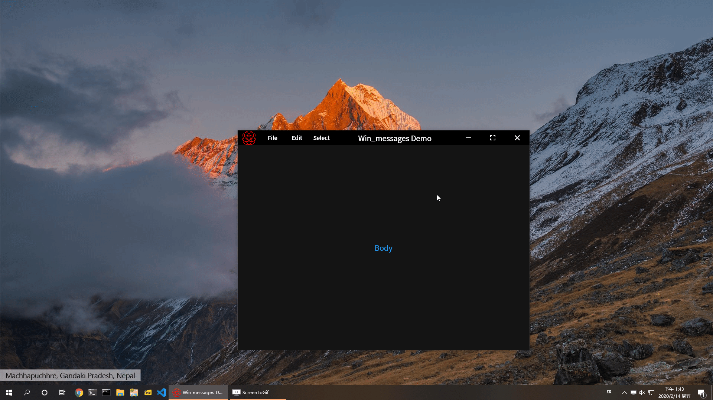

[Warnning] This is a early-stage desktop plugins for 
[flutter-desktop-embedding](https://github.com/google/flutter-desktop-embedding)

I'm not good at windows developing. This project is just works.

Everyone is free to use this project.

Supported Messages:
- WM_CLOSE  
    Sent as a signal that a window or an application should terminate.
- SYSCOMMAND  
    lParam:  
    - SC_MAXIMIZE
        Maximizes the window.
    - SC_MINIMIZE
        Minimizes the window.
    - SC_RESTORE
        Restores the window to its normal position and size.
- [Others]  
    You can modify the source code to support it.